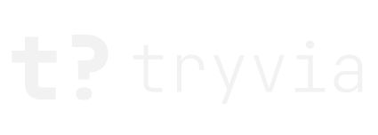

<hr />

<div align="center">
  <h1>Tryvia API</h1>
  <p>Uma API que te traz perguntas rápido e em português.</p>
</div>

<div align="center">
  <a href="#">
    
  </a>
</div>

<hr />

<div align="center">
  
  
  
  
  
  
</div>

<br />

## Como usar?
Essa API é totalmente compatível com a [Open Trivia Database](https://opentdb.com/).

`https://tryvia.ptr.red/api_category.php` - Lista todas as categorias disponíveis e seus respectivos ids.

`https://tryvia.ptr.red/api_token.php?command=request` - Retorna um token para trazer perguntas que não se repitam (tempo de expiração de 6 horas).

`https://tryvia.ptr.red/api.php?amount=${quantidadeDePerguntas}&token=${token}` - Retorna perguntas de categoria, tipo e dificuldades aleatórias.

```url
https://tryvia.ptr.red/api.php
    ?amount=${quantidade de perguntas}
    &category=${null || 0 || id de uma categoria}
    &type=${null || 0 || multiple || boolean}
    &difficulty=${null || 0 || easy || medium || hard}
    &token=${token}
```

Não enviar um parâmetro ou enviá-lo com o valor 0 trará questões com a propriedade correspondente aleatória.
